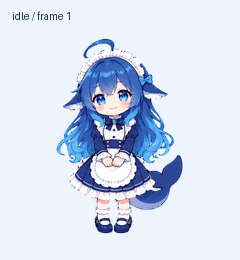

# 蓝色大肥鱼 · Blue Whale Pet

为 Codex / ChatGPT Windows 桌面端准备的动画宠物资源包。使用现成 v2 精灵图，不运行独立桌宠应用。



## 双击安装

1. 从本项目 Releases 下载 `blue-whale-pet-v1.0.0-windows.zip`，**完整解压**到一个文件夹。不要在 ZIP 内直接运行。
2. 双击 `install.cmd`。脚本无需管理员权限，不更改 PowerShell 执行策略，不修改当前宠物选择。
3. 打开桌面端 **Settings → Pets → Refresh**，选择“蓝色大肥鱼”。必要时使用 `/pet` 显示悬浮宠物。

“一键安装”指复制本地宠物文件；刷新和选中仍需完成。账号网页端和 dot 的宠物选择是独立流程，不会因为本地安装自动同步。

需要 Windows、Windows PowerShell 5.1，以及支持本地 v2 宠物的当前 Codex / ChatGPT 桌面端。包格式依据本机 `26.928.3736.0` 内置 `hatch-pet` 的 v2 契约，精灵图为透明 PNG、1536×2288、8×11 单元；没有完成该版本的真实 UI 导入验收，也不承诺更早版本兼容。组织策略可能限制 CMD 或 PowerShell 命令，请遵守组织策略，使用下方手动安装方式。

## 安装位置和冲突

默认使用环境变量 `CODEX_HOME`；未设置时使用 `%USERPROFILE%\.codex`。只写入其下的 `pets\blue-whale-pet`。

相同包重复安装不会改写文件。已有目录不匹配或含额外文件时，默认退出并保留所有内容。明确需要替换时，在 CMD 中运行：

```bat
install.cmd "C:\你的 Codex 目录" --replace
```

原目录会完整移动到同一 `pets` 目录内的 `blue-whale-pet.backup-时间-随机标识`。备份不会自动删除或恢复。恢复时先保留当前目录，再手动将备份改回 `blue-whale-pet`，然后刷新 Pets。

自定义安装目录也可用于测试：

```bat
install.cmd "C:\测试目录\Codex Home"
uninstall.cmd "C:\测试目录\Codex Home"
```

## 卸载

双击 `uninstall.cmd`，再刷新 Pets。脚本只删除拥有本包安装记录、内容哈希仍匹配、没有额外文件的 `blue-whale-pet` 目录。被修改的文件、未知目录、备份及应用选择配置都会保留；遇到修改时需手动确认并处理目录。

## 手动安装

将 `pet` 文件夹里的 `pet.json`、`spritesheet.png` 一起复制到你的 Codex 主目录下 `pets\blue-whale-pet`，然后刷新并选中。手动安装没有脚本安装记录，脚本卸载会拒绝删除，需要手动移除这两个文件。

## 校验与开发

`checksums.json` 包含两个安装文件的 SHA-256。安装前和复制后均进行哈希检查，用于检测传输损坏，不代表发行者身份签名。`scripts/manage.cmd` 包含固定、可直接审查的 PowerShell 命令；`scripts/manage.ps1` 是其可读源代码。它使用 Windows 标准命令模式，不设置执行策略。

在 PowerShell 7 中运行测试：

```powershell
pwsh -NoProfile -File tests/install.Tests.ps1
```

测试只在新建的临时目录操作，包括安装包及目标的空格/中文路径、重复安装、冲突保留、显式备份、卸载保护、目录链接拒绝、`CODEX_HOME` 和源文件损坏。测试目录会保留以便检查。修改 `manage.ps1` 后，运行下面的白名单打包命令同步 `manage.cmd`，再运行测试：

```powershell
pwsh -NoProfile -File scripts/build-package.ps1 -OutputDirectory "C:\发行包输出"
```

输出 ZIP 和 `SHA256SUMS.txt`。若同名 ZIP 已存在，脚本退出，避免覆盖已有发行包。

## 素材与许可

代码及说明文件适用 [MIT 许可](LICENSE)。精灵图和预览不适用 MIT；这是 AI 生成的同人资源，参考角色的第三方权利保留，未取得完整角色再分发许可。请阅读 [素材说明](ASSET-NOTICE.md)，尤其在商用前。

本项目不包含第三方参考原图、制作提示、内部技能脚本、账号标识或制作归档。与 OpenAI 及角色权利人无官方关联。

官方操作说明：[Pets](https://learn.chatgpt.com/docs/pets)。
